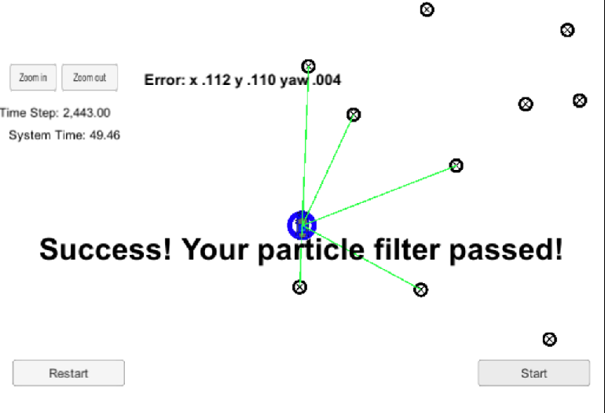

# Overview
This repository contains all the code needed to complete the final project for the Localization course in Udacity's Self-Driving Car Nanodegree.

## Project Introduction
Your robot has been kidnapped and transported to a new location! Luckily it has a map of this location, a (noisy) GPS estimate of its initial location, and lots of (noisy) sensor and control data.

In this project you will implement a 2 dimensional particle filter in C++. Your particle filter will be given a map and some initial localization information (analogous to what a GPS would provide). At each time step your filter will also get observation (landmark position in vehicle coordinate system) and control data (velocity,yaw_rate).

## Localization

In this project we are solving localization problem. Localization means finding the vehicle's position in a map. What we know is

1. The map, which contains landmark's position in map coordinate system.
2. The initial position of the car in map coordinate system.

In every cycle we will get this data

1. The landmark's position from sensor in vehicle coordinate system.
2. The control data i.e velocity and yawrate of the car

What we want to calculate is:

* Where is the car in the map coordinate

## Data flow


#### The Map

`map_data.txt` includes the position of landmarks (in meters) on an arbitrary Cartesian coordinate system. Each row has three columns
1. x position
2. y position
3. landmark id

## Running the Code
This project involves the Term 2 Simulator which can be downloaded [here](https://github.com/udacity/self-driving-car-sim/releases)

This repository includes two files that can be used to set up and intall uWebSocketIO for either Linux or Mac systems. For windows you can use either Docker, VMware, or even Windows 10 Bash on Ubuntu to install uWebSocketIO.

Once the install for uWebSocketIO is complete, the main program can be built and ran by doing the following from the project top directory.

1. mkdir build
2. cd build
3. cmake ..
4. make
5. ./particle_filter

# Implementing the Particle Filter
The directory structure of this repository is as follows:

```
root
|   build.sh
|   clean.sh
|   CMakeLists.txt
|   README.md
|   run.sh
|
|___data
|   |   
|   |   map_data.txt
|   
|   
|___src
    |   helper_functions.h
    |   main.cpp
    |   map.h
    |   particle_filter.cpp
    |   particle_filter.h
```

The only file you should modify is `particle_filter.cpp` in the `src` directory. The file contains the scaffolding of a `ParticleFilter` class and some associated methods. Read through the code, the comments, and the header file `particle_filter.h` to get a sense for what this code is expected to do.

If you are interested, take a look at `src/main.cpp` as well. This file contains the code that will actually be running your particle filter and calling the associated methods.

## Success Criteria

The things the grading code is looking for are:

1. **Accuracy**: your particle filter should localize vehicle position and yaw to within the values specified in the parameters `max_translation_error` and `max_yaw_error` in `src/main.cpp`.

2. **Performance**: your particle filter should complete execution within the time of 100 seconds.

Your job is to build out the methods in `particle_filter.cpp` until the simulator output says:

```
Success! Your particle filter passed!
```



